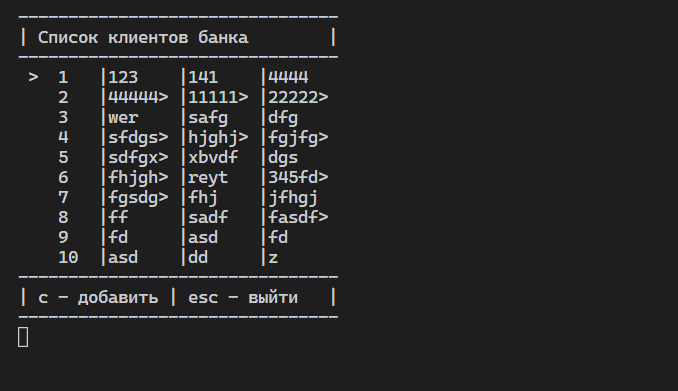

# Программа банковского учета

Данный проект предназначен для демонстрации работы с библиотекой sqlite3 на языке python.

## Реализованный функционал

> - Подключение и чтение записей БД
> - Возможность добавление новых записей в БД
> - Реализовано взаимодействие с пользователем при помощи библиотеки pynput
> - Реализован интерфейс в виде удобных списков

## На что не хватило времени
> - Планировалась возможность трансфера "денежных средства" между счетами (таблица accounts)
> - Отсутствует возможность навигации по списку счетов клиента

Минусы проекта нивелируются объективной необходимостью в переходе на парадигму ООП. В том числе, это касается работы с UI (как GUI, так и TUI).